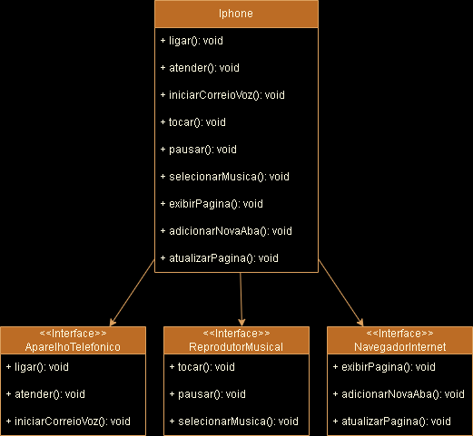

# Desafio de classes iPhone - DIO

## Simulador de Iphone

### Descrição:

#### Este projeto simula as funcionalidades básicas de um Iphone, proposto no desafio de código da plataforma DIO utilizando os padrões de modelagem UML. 

### Algumas funções:

##### Efetuar e atender ligações

##### Iniciar correio de voz

##### Reproduzir música

##### Pausar música

##### Selecionar música

##### Exibir página no navegador

##### Abrir nova aba no navegador

##### Atualizar página no navegador